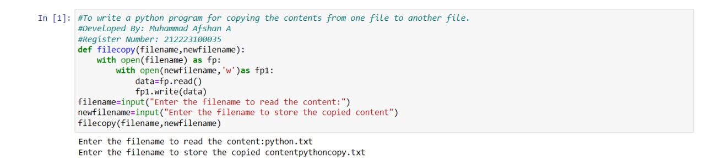
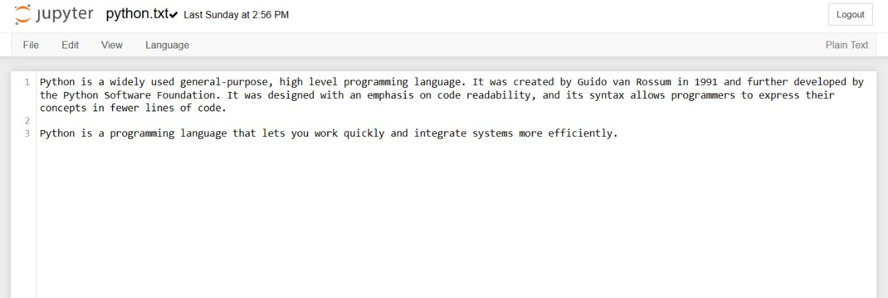
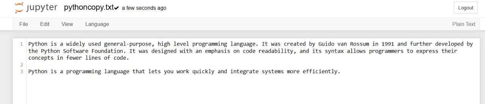

# copy-file
## AIM:
To write a python program for copying the contents from one file to another file.
## EQUIPEMENT'S REQUIRED: 
PC
Anaconda - Python 3.7
## ALGORITHM: 
### Step 1:
Create a file using Notepad with the file1.txt .

### Step 2:
Open Google Colab and mount the drive for using the created file in the Colab.

### Step 3:
Now open the text file in read mode.

### Step 4:
Then read the content in the file and store the data in a variable.

### Step 5:
Now open the new uncreated or an empty file using a different file object, by "w+" mode and write the content derived from first file using write().

### Step 6:
End the program
## PROGRAM:
```
#To write a python program for copying the contents from one file to another file.
#Developed By: Muhammad Afshan A
#Register Number: 212223100035

def filecopy(filename,newfilename):
    with open(filename) as fp:
        with open(newfilename,'w')as fp1:
            data=fp.read()
            fp1.write(data)
filename=input("Enter the filename to read the content:")
newfilename=input("Enter the filename to store the copied content")
filecopy(filename,newfilename)
```

## OUTPUT:
### CODE AND OUTPUT

### ORIGINAL FILE

### COPIED FILE

## RESULT:
Thus the program is written to copy the contents from one file to another file.
